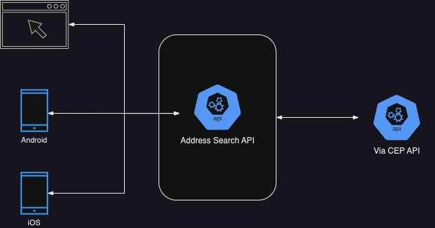

# Desafio Backend - Blessed Bytes

## _Crie um repositório em sua conta do github para desenvoler a solução para este desafio_

## O desafio consiste uma API REST para consulta de informações de endereço baseado no CEP passado como entrada.

### O desenho arquitetural abaixo apresenta com a API deve funcionar.



### A estrutura de request e response deve seguir o seguinte contrato:

Request:

```bash
GET /address?cep=1234567
```

Response:

```json
{
  "zipcode": "51030-630",
  "street": "Rua Sideral",
  "complement": "",
  "neigborhood": "Boa Viagem",
  "city": "Recife",
  "state": "PE"
}
```

### Obs.:

- Crie validações para garantir que o cep passado na entrada seja um número válido

- **Entregar o desafio até o dia 19/07/2023**

### Links úteis para estudo

- [POO - Programação Orientada a Objetos](https://yanborowski.medium.com/princ%C3%ADpios-b%C3%A1sicos-da-programa%C3%A7%C3%A3o-orienta%C3%A7%C3%A3o-a-objetos-poo-62da3998b7ce)
- [SOLID](https://medium.com/desenvolvendo-com-paixao/o-que-%C3%A9-solid-o-guia-completo-para-voc%C3%AA-entender-os-5-princ%C3%ADpios-da-poo-2b937b3fc530)
- [Arquiteutra Hexagonal ou Ports and Adapters](https://dev.to/wsantosdev/design-ports-and-adapters-48mi?utm_source=pocket_saves)
